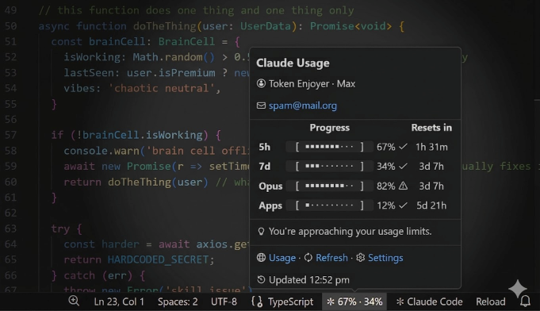

# ✼ Claude Usage Status Bar

No more hitting usage limits mid-flow. See your Claude Code current session and weekly limits directly in the VS Code status bar.

## What it does

Sits in your status bar showing real-time utilization across your 5-hour session, 7-day, Opus, and Apps windows. Click it for the full breakdown: progress bars, reset countdowns, account info, the whole thing.

## Settings

| Setting | Default | Description |
| ------- | ------- | ------------|
| Update Interval    | `300`   | How often to poll for usage, in seconds |
| Status Bar Display | `Both`  | Which usage stat to display: `Session`, `Weekly` or `Both` |
| Show Notifications | `False` | Get pinged when any window hits 90% |

## Authentication

The extension reads your existing Claude Code credentials, no separate login needed.

**macOS:** reads the OAuth token directly from your system Keychain (added by Claude Code on login).

**Linux:** reads from `~/.claude/.credentials.json`.

User info (name, email, subscription type) is pulled from `~/.claude.json`.

If the status bar shows an auth error, re-run `claude` in your terminal to refresh your credentials, then reload the VS Code window.

## Requirements

VS Code 1.74.0+, active Claude Code subscription.

## License

MIT - [Jonathan Mackay](https://github.com/jjsmackay)
